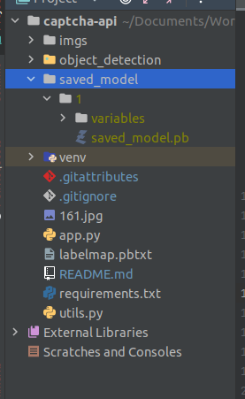
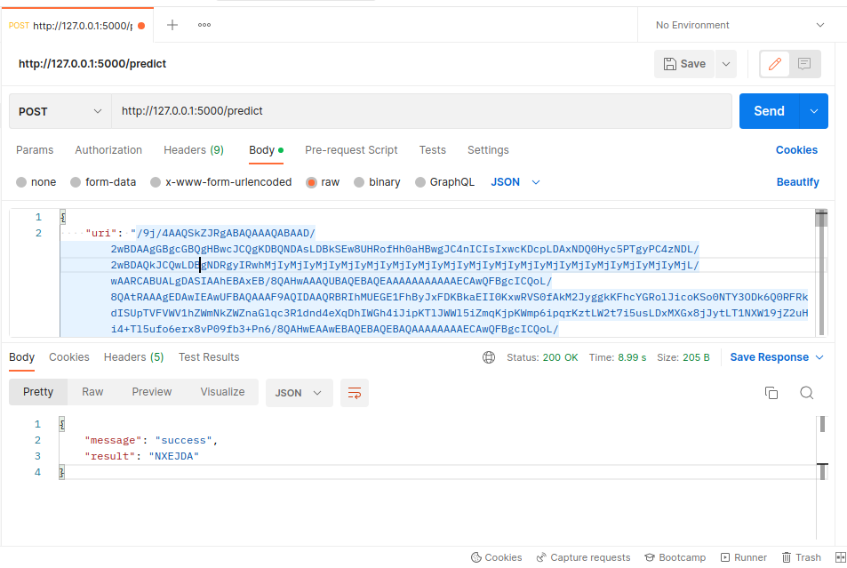

# Captcha code solver api
Python flask API that resolve base64 captcha image. 

----


## Prerequisite

- Python3
- Flask
- [TensorFlow Object Detection API](https://github.com/tensorflow/models/tree/master/research/object_detection)

## Installation
1. Clone this repository to your workspace
```shell
git clone https://github.com/parth-p-7span/captcha-api.git
```
2. Navigate to captcha-api folder in your Terminal/CMD.
```shell
cd captcha-api
```
3. Now install the required libraries using following command.
```shell
pip install -r requirements.txt
```
4. Run the following command in your terminal/CMD
```shell
protoc object_detection/protos/*.proto --python_out=.
```
5. Download the pretrained model files from [here](https://drive.google.com/drive/folders/1fi75aSH7AcNO9fC6Gco14PzuWKDQiGLP?usp=sharing)
6. Then extract the zip file and paste it in the root directory of project. Then rename that folder to `saved_model`.
    - Now the directory structure will look like this
    - 
7. Run the project using following command
```shell
python main.py
```

---
## Usage



## Notes
Model Used : ```Faster R-CNN Inception ResNet V2 640x640```
